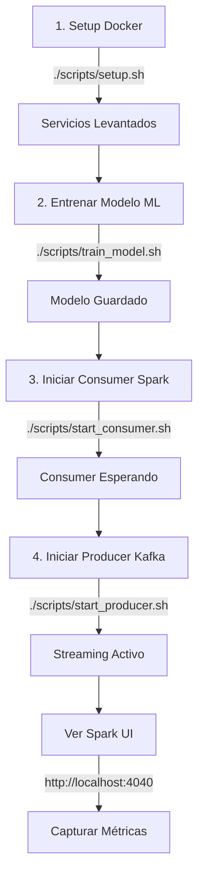

# Resumen del Proyecto: Arquitectura de Grandes Volúmenes de Datos

## Información General

**Asignatura**: Arquitectura de Grandes Volúmenes de Datos
**Objetivo**: Procesamiento en tiempo real de datos de fútbol con comparación de rendimiento entre arquitecturas
**Tecnologías**: Apache Spark 3.5.0, Apache Kafka 7.5.0, Python 3.8+, Docker

---

## Componentes Implementados

### ✅ 1. Infraestructura Docker

**Archivos**:
- [docker-compose.yml](docker-compose.yml) - Orquestación de 5 servicios
- [Dockerfile](Dockerfile) - Imagen personalizada Python/Spark
- [requirements.txt](requirements.txt) - Dependencias Python

**Servicios Docker**:
1. **Zookeeper** (puerto 2181) - Coordinación de Kafka
2. **Kafka** (puerto 9092) - Message broker
3. **Spark Master** (puertos 7077, 8080, 4040) - Coordinador de cluster
4. **Spark Worker** (puerto 8081) - Nodo de procesamiento
5. **PySpark App** - Contenedor de aplicación

---

### ✅ 2. Productor de Kafka

**Archivo**: [src/productor.py](src/productor.py)

**Funcionalidad**:
- Descarga datos de La Liga desde Statsbomb API
- Serializa eventos a JSON
- Envía eventos a Kafka con delay configurable (0.5s)
- Simula streaming en tiempo real

**Uso**:
```bash
docker exec -it pyspark-app python src/productor.py
```

**Configuración**:
- Topic: `statsbomb-eventos`
- Delay: 0.5 segundos entre eventos
- Límite: 5 partidos (configurable)

---

### ✅ 3. Consumidor Spark Streaming

**Archivo**: [src/procesador_streaming.py](src/procesador_streaming.py)

**Funcionalidad**:
- Lee eventos desde Kafka usando Spark Structured Streaming
- Calcula estadísticas en ventanas de 5 minutos:
  - **Posesión** por equipo (%)
  - **Expected Goals (xG)** promedio
  - **Pases completados** (%)
- Guarda datos en formato Parquet
- Muestra estadísticas en consola en tiempo real

**Uso**:
```bash
docker exec -it pyspark-app spark-submit \
  --master spark://spark-master:7077 \
  --packages org.apache.spark:spark-sql-kafka-0-10_2.12:3.5.0 \
  src/procesador_streaming.py
```

**Salidas**:
- `/app/data/processed/events_raw/` - Eventos crudos (Parquet)
- `/app/data/processed/possession_stats/` - Estadísticas de posesión
- `/app/data/processed/xg_stats/` - Estadísticas de xG
- `/app/data/processed/pass_stats/` - Estadísticas de pases

---

### ✅ 4. Machine Learning

**Archivo**: [src/entrenamiento_ml.py](src/entrenamiento_ml.py)

**Modelo**: Random Forest Classifier

**Features** (del primer tiempo):
- Posesión del balón (home/away)
- Número de tiros
- xG total
- Pases totales y completados
- Tasa de éxito en pases
- Duelos y tackles

**Target**: Resultado del partido
- `home_win` - Victoria local
- `away_win` - Victoria visitante
- `draw` - Empate

**Uso**:
```bash
docker exec -it pyspark-app python src/entrenamiento_ml.py
```

**Salida**:
- `/app/data/models/modelo.joblib` - Modelo entrenado
- `/app/data/models/scaler.joblib` - Escalador de features
- `/app/data/models/model_metadata.joblib` - Metadatos

---

### ✅ 5. Inferencia en Tiempo Real

**Archivo**: [src/utils/inference.py](src/utils/inference.py)

**Funcionalidad**:
- Carga modelo entrenado
- Extrae features de estadísticas agregadas
- Realiza predicciones en tiempo real
- Formatea resultados para visualización

**Integración**: El consumidor puede cargar el modelo y hacer predicciones durante el streaming.

---

### ✅ 6. Scripts de Utilidad

**Directorio**: [scripts/](scripts/)

**Scripts disponibles**:

1. **setup.sh** - Configuración inicial completa
   ```bash
   ./scripts/setup.sh
   ```

2. **train_model.sh** - Entrenar modelo ML
   ```bash
   ./scripts/train_model.sh
   ```

3. **start_consumer.sh** - Iniciar Spark Streaming
   ```bash
   ./scripts/start_consumer.sh
   ```

4. **start_producer.sh** - Iniciar productor Kafka
   ```bash
   ./scripts/start_producer.sh
   ```

5. **stop_services.sh** - Detener todos los servicios
   ```bash
   ./scripts/stop_services.sh
   ```

6. **view_logs.sh** - Ver logs de servicios
   ```bash
   ./scripts/view_logs.sh [service_name]
   ```

---

### ✅ 7. Documentación

**Archivos**:
- [README.md](README.md) - Documentación completa (200+ líneas)
- [QUICK_START.md](QUICK_START.md) - Guía de inicio rápido
- [PROJECT_SUMMARY.md](PROJECT_SUMMARY.md) - Este archivo

**Notebooks**:
- [notebooks/01_analisis_exploratorio.ipynb](notebooks/01_analisis_exploratorio.ipynb) - Análisis de datos procesados

---

### ✅ 8. Configuración

**Archivos**:
- [.env.example](.env.example) - Variables de entorno template
- [config/spark/spark-defaults.conf](config/spark/spark-defaults.conf) - Configuración de Spark
- [.gitignore](.gitignore) - Archivos ignorados (incluye datos)
- [.dockerignore](.dockerignore) - Archivos excluidos de Docker build

---

## Estructura del Proyecto

```
no_cuda/
├── docker-compose.yml          # Orquestación Docker
├── Dockerfile                  # Imagen Python/Spark
├── requirements.txt            # Dependencias
├── .env.example               # Variables de entorno
├── .gitignore                 # Git ignore
├── .dockerignore              # Docker ignore
│
├── README.md                  # Documentación completa
├── QUICK_START.md            # Inicio rápido
├── PROJECT_SUMMARY.md        # Este archivo
│
├── src/                       # Código fuente
│   ├── __init__.py
│   ├── productor.py          # ✅ Productor Kafka
│   ├── procesador_streaming.py  # ✅ Consumidor Spark
│   ├── entrenamiento_ml.py   # ✅ Entrenamiento ML
│   └── utils/
│       ├── __init__.py
│       └── inference.py      # ✅ Inferencia tiempo real
│
├── scripts/                   # Scripts de utilidad
│   ├── setup.sh              # ✅ Setup inicial
│   ├── train_model.sh        # ✅ Entrenar modelo
│   ├── start_consumer.sh     # ✅ Iniciar consumer
│   ├── start_producer.sh     # ✅ Iniciar producer
│   ├── stop_services.sh      # ✅ Detener servicios
│   └── view_logs.sh          # ✅ Ver logs
│
├── data/                      # Datos (gitignored)
│   ├── raw/                  # Datos crudos
│   ├── processed/            # Parquet files
│   │   ├── events_raw/
│   │   ├── possession_stats/
│   │   ├── xg_stats/
│   │   └── pass_stats/
│   └── models/               # Modelos entrenados
│       ├── modelo.joblib
│       ├── scaler.joblib
│       └── model_metadata.joblib
│
├── notebooks/                 # Jupyter notebooks
│   └── 01_analisis_exploratorio.ipynb  # ✅ Análisis
│
└── config/                    # Configuraciones
    └── spark/
        └── spark-defaults.conf  # ✅ Config Spark
```

---

## Flujo de Ejecución

### Secuencia Completa



### Terminales Requeridas

**Terminal 1**: Consumer Spark (Streaming)
```bash
./scripts/start_consumer.sh
```

**Terminal 2**: Producer Kafka (Eventos)
```bash
./scripts/start_producer.sh
```

**Terminal 3**: Monitoreo y comandos
```bash
./scripts/view_logs.sh
```

**Navegador**: Spark UI
```
http://localhost:4040
```

---

## Comparación de Rendimiento

### Arquitecturas Objetivo

| Arquitectura | CPU | RAM | Descripción |
|--------------|-----|-----|-------------|
| **Alta** | Intel i7 (11va gen) | 32 GB | Alto rendimiento |
| **Baja** | Intel i3 | 8 GB | Bajo rendimiento |

### Métricas a Capturar

**Desde Spark UI** (http://localhost:4040):

#### Jobs Tab
- [ ] Duración total de cada job
- [ ] Número de stages
- [ ] Número de tasks

#### Stages Tab
- [ ] Duration
- [ ] Shuffle Read (size, records)
- [ ] Shuffle Write (size, records)
- [ ] Input/Output size

#### Tasks Tab
- [ ] Scheduler Delay
- [ ] Task Deserialization Time
- [ ] **Executor Run Time** ⭐
- [ ] Result Serialization Time
- [ ] **GC Time** ⭐
- [ ] Shuffle Read/Write Time

#### Executors Tab
- [ ] Memory Used/Available
- [ ] **Disk Spill** ⭐
- [ ] **Memory Spill** ⭐
- [ ] Task Time
- [ ] Failed Tasks

#### Streaming Tab
- [ ] Input Rate (eventos/segundo)
- [ ] Processing Time
- [ ] Scheduling Delay
- [ ] Total Delay

**⭐ = Métrica crítica para comparación**

---

## Configuración para Comparación Justa

### Mismo Hardware Lógico

Ambas máquinas deben usar **la misma configuración de Spark**:

```yaml
# En docker-compose.yml
spark-worker:
  environment:
    - SPARK_WORKER_MEMORY=2G
    - SPARK_WORKER_CORES=2
```

### Mismo Dataset

Ambos deben procesar:
- Mismos partidos (usar `MATCH_LIMIT=5`)
- Mismo delay entre eventos (`EVENT_DELAY=0.5`)
- Misma ventana de tiempo (5 minutos)

---

## Resultados Esperados

### Hipótesis

**Intel i7 / 32GB**:
- Menor tiempo de ejecución
- Menor GC Time
- Sin/poco Memory Spill
- Sin Disk Spill
- Mayor throughput

**Intel i3 / 8GB**:
- Mayor tiempo de ejecución
- Mayor GC Time (más frecuente)
- Posible Memory Spill
- Posible Disk Spill
- Menor throughput
- Posible backpressure en Kafka

### Cuellos de Botella Esperados

**i7/32GB**: CPU (procesamiento)
**i3/8GB**: Memoria (GC, spill a disco)

---

## Próximos Pasos para el Proyecto

### Fase 1: Ejecución ✅
1. ✅ Levantar entorno Docker
2. ✅ Entrenar modelo ML
3. ✅ Ejecutar streaming completo

### Fase 2: Captura de Métricas 🔄
1. [ ] Ejecutar en Arquitectura 1 (i7/32GB)
2. [ ] Capturar screenshots de Spark UI
3. [ ] Anotar métricas en tabla
4. [ ] Ejecutar en Arquitectura 2 (i3/8GB)
5. [ ] Capturar screenshots de Spark UI
6. [ ] Anotar métricas en tabla

### Fase 3: Análisis 📊
1. [ ] Comparar métricas entre arquitecturas
2. [ ] Identificar cuellos de botella
3. [ ] Crear visualizaciones
4. [ ] Documentar hallazgos

### Fase 4: Presentación 🎯
1. [ ] Preparar slides con resultados
2. [ ] Incluir screenshots de Spark UI
3. [ ] Explicar diferencias observadas
4. [ ] Conclusiones y aprendizajes

---

## Recursos y Referencias

### Documentación Técnica
- [Spark Structured Streaming Guide](https://spark.apache.org/docs/latest/structured-streaming-programming-guide.html)
- [Kafka Documentation](https://kafka.apache.org/documentation/)
- [Statsbomb Open Data](https://github.com/statsbomb/open-data)

### Herramientas de Monitoreo
- Spark UI: http://localhost:4040
- Spark Master UI: http://localhost:8080
- Kafka logs: `docker-compose logs kafka`

### Comandos Útiles
```bash
# Estado de servicios
docker-compose ps

# Logs en tiempo real
docker-compose logs -f

# Uso de recursos
docker stats

# Acceder al contenedor
docker exec -it pyspark-app bash

# Reiniciar desde cero
docker-compose down -v && ./scripts/setup.sh
```

---

## Contacto y Soporte

Para problemas o preguntas:
1. Consultar [README.md](README.md) - Troubleshooting section
2. Revisar logs: `./scripts/view_logs.sh`
3. Reintentar: `docker-compose restart [service]`

---

## Licencia

Proyecto educativo para la asignatura de Arquitectura de Grandes Volúmenes de Datos.
Datos de Statsbomb sujetos a su licencia de uso.

---

**Estado del Proyecto**: ✅ COMPLETO Y LISTO PARA EJECUTAR

**Última actualización**: 2025-11-11

---

🚀 **¡Éxito con tu proyecto!** ⚽
